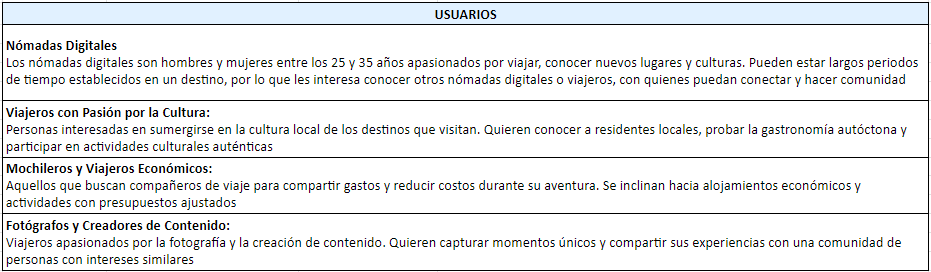
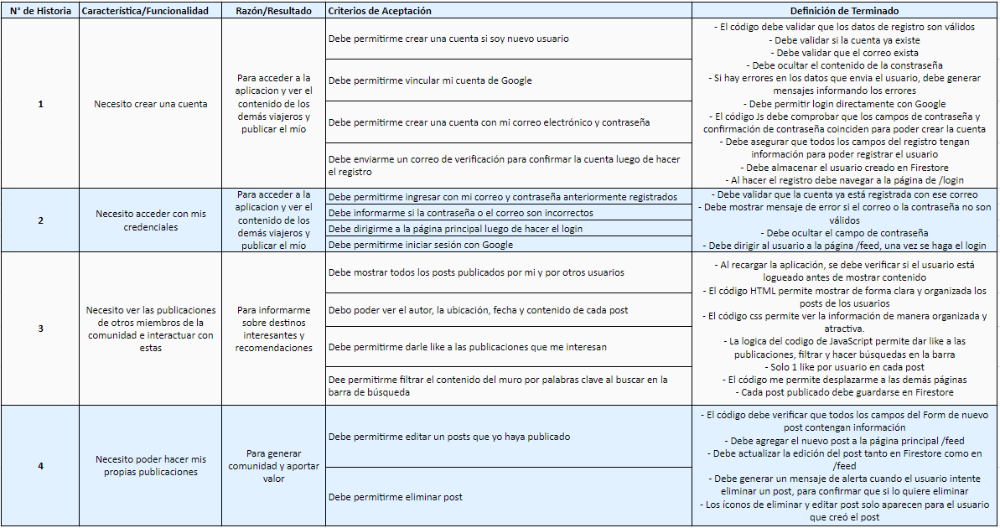
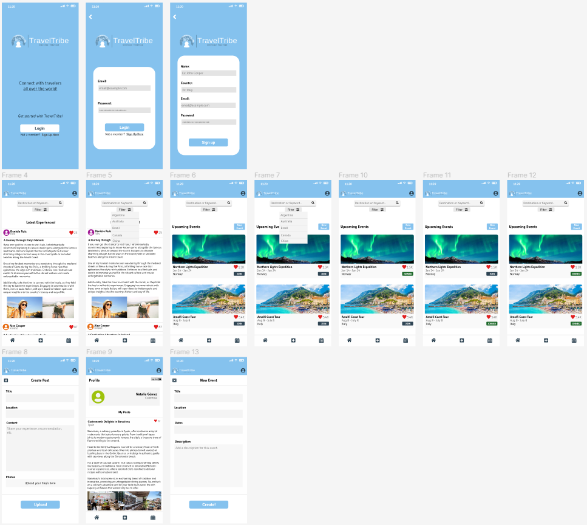

  

---

# TravelTribe: Discover Together

## Índice

* [1. Introducción](#1-presentando-traveltribe-donde-los-exploradores-se-unen-en-todo-el-mundo)
* [2. Funcionalidades](#2-funcionalidades)
* [3. Historias de Usuario](#3-historias-de-usuario)
* [4. Prototipos](#4-prototipos)
* [5. Despliegue](#5-despliegue)

## 1-Presentando TravelTribe: Donde los Exploradores se Unen en Todo el Mundo

La aventura no tiene límites. Se trata de los lazos que forjas, las culturas que abrazas y las historias que creas. Bienvenido a TravelTribe, una innovadora plataforma social que trasciende fronteras, dirigida tanto a espíritus nómadas como a mochileros con presupuesto ajustado, así como a entusiastas de la cultura. Aquí, creemos que viajar no es solo un recorrido; es una experiencia compartida, una historia contada y un vínculo establecido.

## 2-Funcionalidades

- **Publica Experiencias**: Conecta con otros viajeros compartiendo tus asombrosas experiencias y recomendaciones de los lugares que has visitado.

- **Consejos en Tiempo Real**: ¿Necesitas ideas para tu próxima aventura? Formula preguntas a la comunidad de TravelTribe y recibe recomendaciones personalizadas y consejos internos.

- **Encuentros y Eventos**: Únete o crea eventos que se alineen con tus intereses, desde encuentros nómadas hasta exploraciones asequibles en la ciudad.

- **Intercambio Cultural**: Conecta con exploradores afines que comparten tu pasión por las culturas, enriqueciendo tu viaje con interacciones significativas.

- **Interacción Vibrante en la Comunidad**: Forja relaciones con personas de todo el mundo y construye tu comunidad global.

## 3-Historias de Usuario

TravelTribe aborda desafíos identificados en la comunidad viajera a través de investigación. Conecta a viajeros solitarios al crear una comunidad global, y proporciona información confiable y auténtica directamente de personas que han explorado destinos. Facilita encontrar compañeros de viaje y organizar eventos, lo que fomenta conexiones profundas entre los aventureros. Además, fomenta el intercambio cultural y la conexión con culturas locales. TravelTribe simplifica la planificación de eventos y excursiones, al tiempo que inspira a futuros viajeros a través de experiencias compartidas y consejos. En resumen, TravelTribe es una solución integral que reúne a los amantes de los viajes y supera retos, formando una comunidad unida y enriquecedora.

- **Perfiles de Usuario**

Basado en lo anterior, se definieron los siguientes perfiles como potenciales usuarios y miembros de la comunidad TravelTribe.

- **Historias de Usuario**

Posteriormente se definieron las Historias de Usuario, enfocadas en satisfacer las necesidades principales de los perfiles de usuario mencionados anteriormente.

## 4-Prototipo

Teniendo en cuenta la investigación y definición de los perfiles e historias de usuario, se propuso el siguiente prototipo de alta fidelidad. Posteriormente, este prototipo fue sometido a validaciones por parte de usuarios potenciales, donde se buscada validar aspectos relacionados con el diseño de la red social, facilidad de uso, cumplimiento de historias de usuraio, entre otros aspectos.

A medida que se iba desarrollando la aplicación se continuaron haciendo validaciones, las cuales llevaron a cambios en términos de diseño, ubicación de los botones e íconos y funcionalidades específicas para robustecer las historias de usuario.

Puede acceder al prototipo en Figma en el siguiente [Link](https://www.figma.com/proto/wgnxhHGcfCxJDsFJrFUUIy/Mobile-Prototype?type=design&node-id=2-3&t=vKeKAM2ecOGhGF6x-0&scaling=scale-down&page-id=0%3A1&starting-point-node-id=2%3A3).

## 5-Despliegue

Como último paso se hizo el despliegue de la aplicación web utilizando Firebase. Para acceder a la aplicación web haga click en el siguiente [Link](https://traveltribe-27207.web.app/).